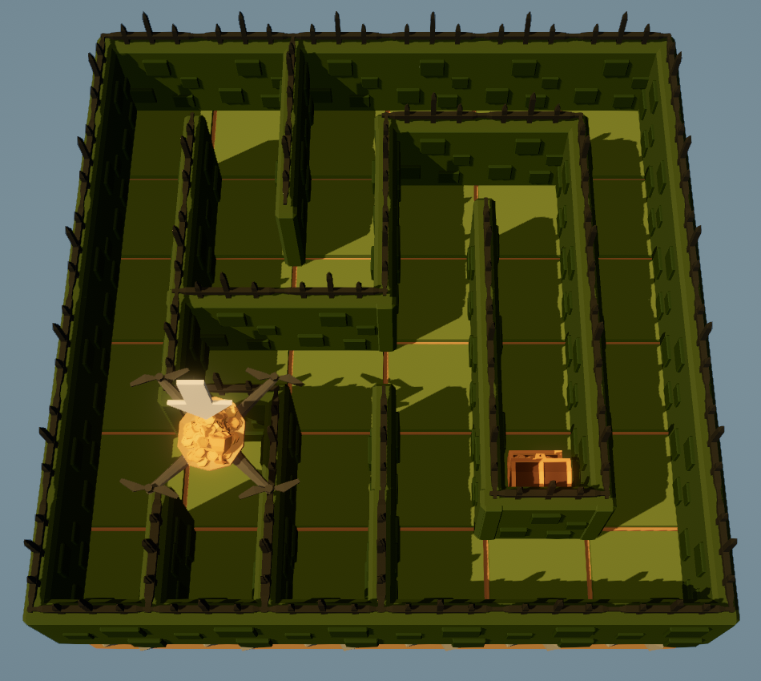
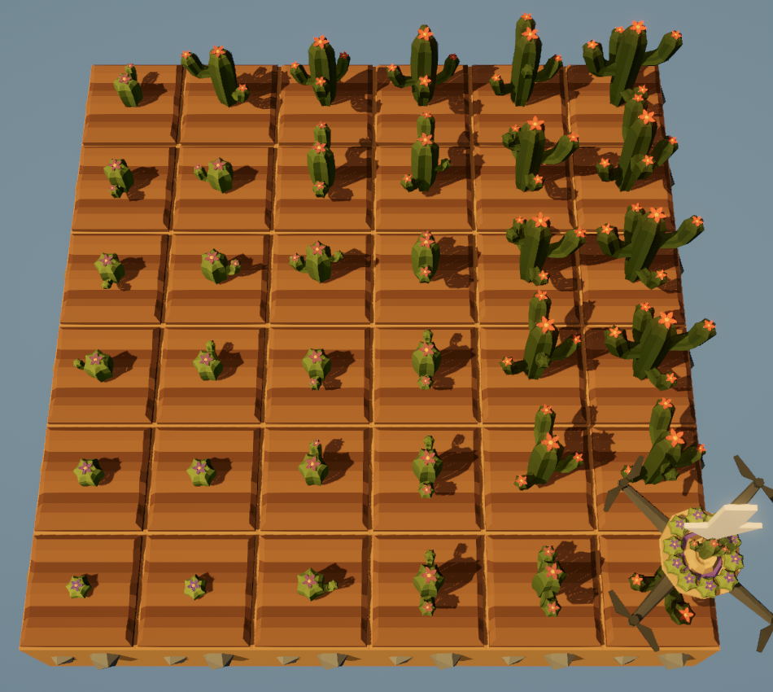
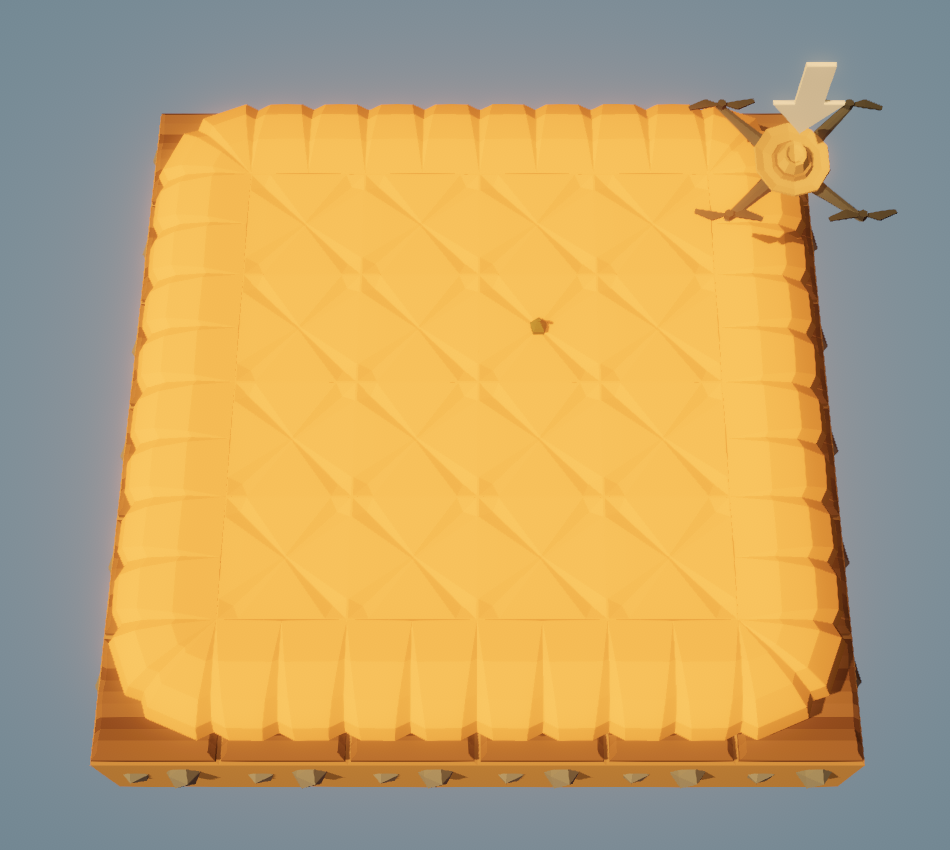
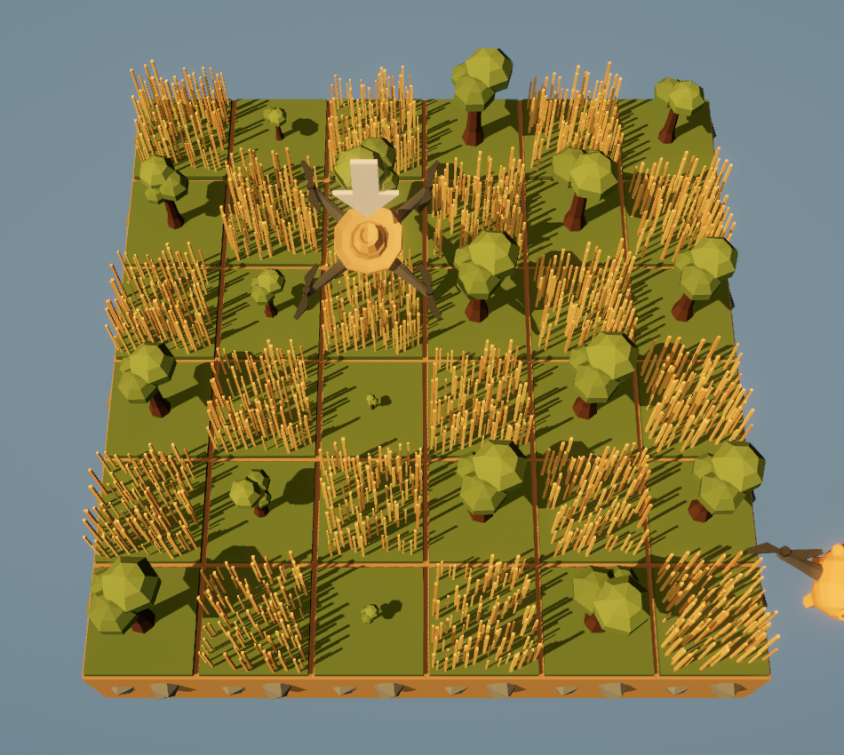

# The Farmer Was Replaced Walkthrough

The aim of this project is to track the progress of `The Farmer Was Replaced`. The Game is about controlling a drone by writing your own code. The language used is similar to python with custom built-in functions such as harvest() and plant().

## Current Tasks
Ordered by (Difficulty)

- Revisit Cactus Sorting Algorithm **(High)**
- Maze Solver for Maze with loops **(Med)**
- Sunflower Farm **(Low)** - **Finished**
- Dinosaurs **(Low)**
- MegaFarm **(Low)** - **WIP**
- Refactor Code **(Low)**
- Clean Directory **(Low)**

## Recent Achievements

<table width="100%">
  <tr>
    <td valign="top" width="70%">
      <b>Maze Solver</b> 
      <b>Description:</b> Needed a way to navigate mazes to find treasure. I implemented the wall-following algorithm e.g follow the left/right wall until maze is solved.  
      <b> Algorithm:</b>
      <ul>
        <li>Always Turn Right</li>
        <li>if blocked &rarr; Move Forward</li>
        <li>&nbsp;&nbsp;if blocked &rarr; Turn Left</li>
        <li>&nbsp;&nbsp;&nbsp;&nbsp;if blocked &rarr; Turn Around</li>
      </ul>
       
      This approach only works on closed-loop mazes. Future work involves implementing an open-loop maze solver.
    </td>
    <td valign="top" align="center" width="30%">
      
    </td>
  </tr>
  <tr>
    <td valign="top" width="70%">
      <b>Cactus Sorting</b> 
      <b>Description:</b> A cactus is considered sorted if the neighboring cacti to the North and East are fully grown and >= in size. All cacti to the South and West are fully grown and <= in size. Size can be retrieved using measure() with values ranging from 0-9.   If a square of grown cacti is sorted by size and you harvest one cactus, it will harvest the entire square. So the optimal approach is to sort every cactus then harvest a single cactus.
        
      <b>Problem:</b> My approach was to implement a sorting algorithm and apply to every row then every column. We are limited to comparing with cacti North, East, South,West so i needed a neighbour comparison sorting algorithm. I settled on BubbleSort as it was easy to implement and adapt to the game.
       
      I aim to implement a faster sorting algorithm as BubbleSort has very high time complexity.
    </td>
    <td valign="top" align="center" width="30%">
      
    </td>
  </tr>
  <tr>
    <td valign="top" width="70%">
      <b>Pumpkin Farm</b> 
      <b>Description:</b> Explanation of Problem / Approach / Optimising
    </td>
    <td valign="top" align="center" width="30%">
      
    </td>
  </tr>
  <tr>
    <td valign="top" width="70%">
      <b>Tree Farm</b> 
      <b>Description:</b> Explanation of Problem / Approach / Optimising
    </td>
    <td valign="top" align="center" width="30%">
      
    </td>
  </tr>
</table>

---
